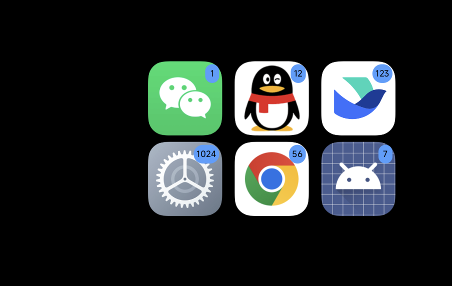
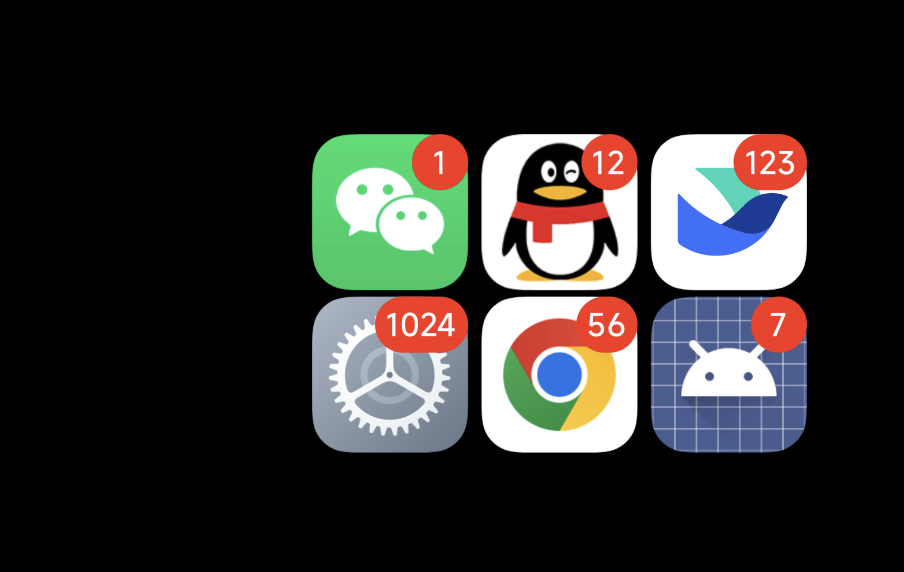
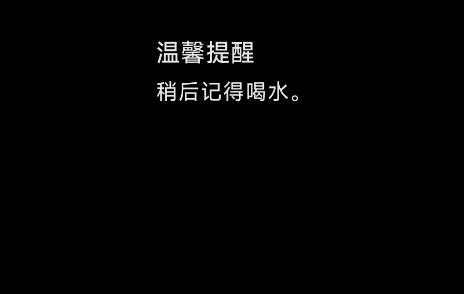
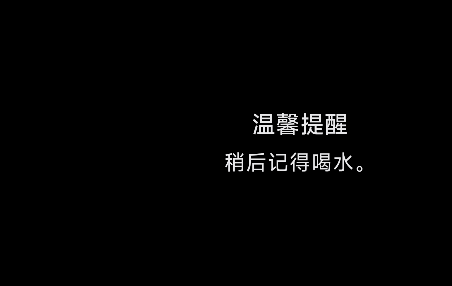
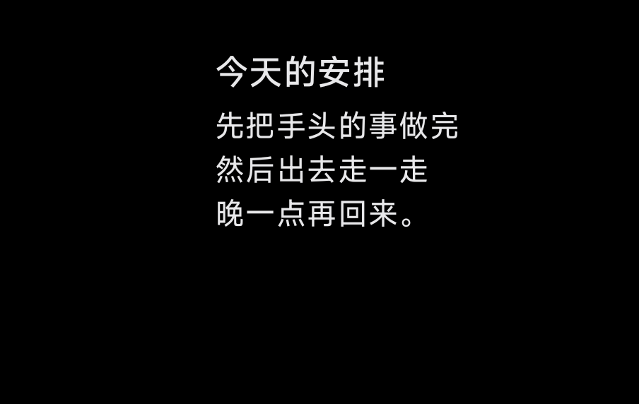
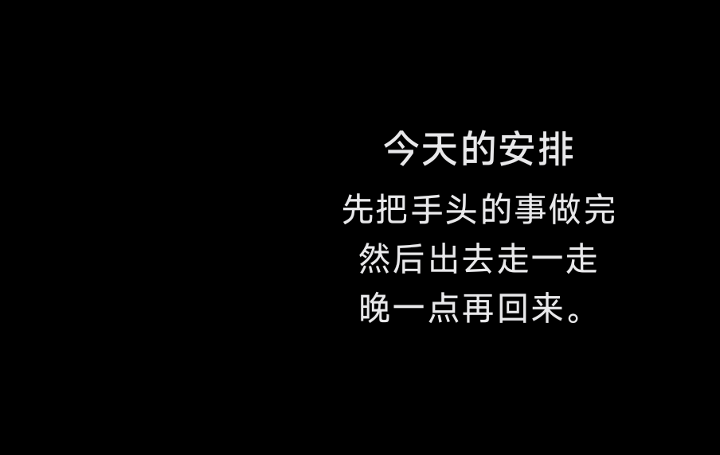
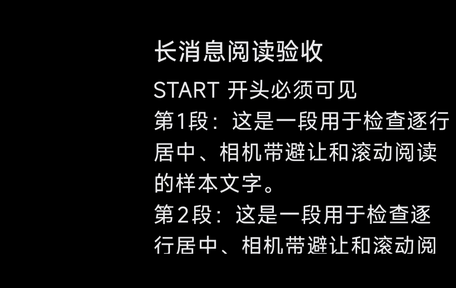
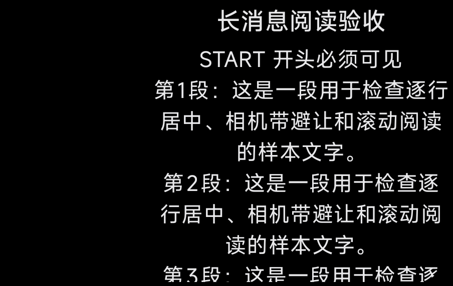
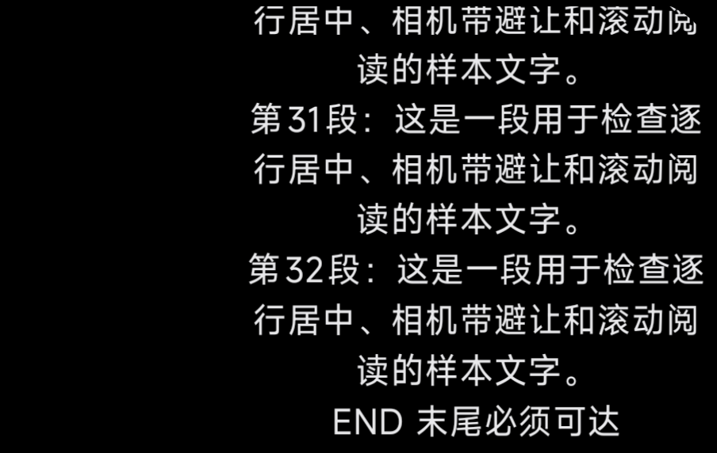

# Spec 0012：通知图标、角标及详情排版验收

**用户验收未通过，原 PASS 结论已撤回。** 本目录保留首版采样事实及自动化结果，不能作为最终视觉达标证明。遗漏包括：角标应向右上外探、充电时图标仍约 114px，以及用户明确要求 Agent Mirror 也采用居中与上下 8px。PR #127 已恢复草稿返修；最新要求以规格 0012 为准。

日期：2026-09-28。规格 [0012](../../specs/0012-desktop-like-notification-icons.md)，工单 #124 / #125 / #126，PR #127。

生产源码验收提交：`98cf815eba55af3202700bd52d0521f46a1863c9`；审查基点：`97e0960df74fab9d8caf51a1594862c1e51813d0`。

## 结果与范围

六宫格中的图标和角标更清晰；详情标题与正文作为整体垂直居中，各行水平居中。长文保留上下最小 8 物理 px 的阅读视口，能从开头滚到末尾。

| 验证层次 | 结果 | 证据与边界 |
| --- | --- | --- |
| 生产构建 | PASS | `:app:assembleDebug`，见 [构建记录](final-validation.log) |
| 自动化回归 | PASS | `:rear:testDebugUnitTest` 144 项、`:core:test` 181 项；共 325 项，0 失败、0 错误、0 跳过。见 [测试汇总](test-summary.json) |
| Standards 审查 | 0 项问题 | 独立 reviewer 对照 AGENTS.md、领域文档与仓库惯例审查 |
| Spec 审查 | 0 项问题 | 另一 reviewer 对照规格 28 条用户故事与两个实施票审查 |
| 真机生产视图 | PASS | 独立测试包加载实际生产 `RearDashboardActivity`，注入合成 Feed；下方 22 张截图均为合成样本 |
| 真实通知端到端 | 未重跑 | 本轮未以真实通知验证监听、排序来源、点击取消和外部投送；相关 `:core` 回归通过，不等价于设备端到端证明 |
| 硬件遮挡与肉眼观感 | 部分验证 | 运行时相机带坐标、圆角几何、截图已核对；没有外部实拍或用户肉眼确认，截图不能独立证明硬件遮挡与色彩观感 |

测试包只查询已安装应用的图标及标签，不接入真实通知容器。正式 APK 已构建，未覆盖设备上的正式应用。最后尝试点击验证时原应用接管背屏，所获两帧不是夹具样本，已剔除，不计为展开/收起验收。测试包已退出并卸载；确认正式 RearCue 进程仍在、背屏归属正式应用。

## 桌面参照与实测

设备型号 `25098PN5AC`（pandora），字体比例 1.0。主屏 1220 × 2656、逻辑密度 520 dpi、物理水平密度约 460.446 dpi；背屏 904 × 572、逻辑密度 450 dpi、物理水平密度约 400.028 dpi。桌面截图仅保留在本地，未发布个人桌面布局。

同一物理尺寸换算使用 `400.028 / 460.446 ≈ 0.869`，不把两块屏幕的截图像素直接等同。

| 项目 | 桌面参照 / 等效背屏尺寸 | 修改前背屏 | 修改后背屏 |
| --- | --- | --- | --- |
| 图标外轮廓 | 桌面独立图标约 186px，等效背屏约 162px | 六宫格样本约 148 × 148px | 约 156 × 156px；六个应用容量优先 |
| 一位角标底片 | 桌面约 65px，等效背屏约 56.5px | 蓝色窄底片，阈值测量约 27 × 37px | 红色圆底片，阈值测量约 55 × 55px，布局目标 20dp = 56.25px |
| 数字墨迹高度 | 桌面数字 4 约 27px，等效背屏约 23.5px | 数字 1 约 12px | 数字 1 约 23px；白字，多位数字完整 |

图像分析按颜色阈值排除抗锯齿边缘，结果为近似墨迹/色块尺寸，不等同于布局尺寸或字号。桌面参照与背屏使用相同 ICC 描述 `Display P3 Gamut with sRGB Transfer`：桌面角标原始像素主色为 `#E6462F`，转换到 Compose 默认 sRGB 后为 `#FA311B`；新背屏截图原始主色同为 `#E6462F`。保留应用原始图标轮廓。局部测量数据见 [measurements.json](measurements.json)。

详情运行时几何为：左侧相机带 `[0,296)`、圆角半径 97px、漂移幅度 8px。详情视口为 `[304,8,896,564)`，中心 `(600,286)`。宽度保持 592px；只对首尾实际进入圆角的行增加纵向留白。短文墨迹块的上下界约为 226..344px，中心约 285px，与布局中心吻合。带中文句号的行末包含字形留白，墨迹中心可略偏离排版中心，不能把墨迹外接框当成文本 advance 宽度。

## 前后对照

| 场景 | Before | After |
| --- | --- | --- |
| 六应用、多位角标 |  |  |
| 短通知 |  |  |
| 多行通知 |  |  |
| 长文开头 |  |  |

长文实际发送背屏滑动手势后到达末尾，`END 末尾必须可达` 完整可见：



## 样本矩阵

| 样本 | 观察结果 |
| --- | --- |
| [1 个应用 / 1 条通知](after/grid-1.png) | 保留单条大图标、无角标 |
| [1 个应用 / 12 条通知](after/grid-one-app-multiple.png) | 切为网格档、完整显示 12 |
| [2](after/grid-2.png) / [3](after/grid-3.png) / [4](after/grid-4.png) / [5](after/grid-5.png) / [6](after/grid-6.png) 个应用 | 每行居中，同一非充电网格档尺寸稳定，三列两行 |
| [7 个应用](after/grid-7.png) | 最多六图标，底部 +1 |
| [1、12、123、1024、56、7](after/grid-digits.png) | 一至四位计数完整，无邻格遮挡 |
| [充电 68%](after/grid-charging.png) / [100%](after/grid-full-charge.png) | 保留为电量数字让位的缩放，角标仍清晰，图标与电量无重叠 |
| [通知高亮](after/grid-highlight.png) | 高亮光晕保留，数字可读 |
| [短文](after/detail-short.png) / [多行](after/detail-multiline.png) | 标题正文整体垂直居中、各行水平居中 |
| [只有标题](after/detail-titleonly.png) / [标题等于应用名](after/detail-omitted.png) | 按实际剩余内容居中，重复应用名标题省略 |
| [长文开头](after/detail-long.png) / [长文末尾](after/detail-long-end.png) | 初入从开头显示，实际滚动后 END 完整可达；滚动中的中间行允许在视口边缘暂时裁剪，均可滚到完整位置 |

8px 指布局视口边界，字体 ascent/descent 和短文居中都会使墨迹留白更大。图标随既有分钟漂移而整体偏移，前后图的绝对坐标不作为尺寸比较依据。

## 复现与产物

生产验证命令（JDK 17）：

```powershell
.\gradlew.bat :rear:testDebugUnitTest :core:test :app:assembleDebug --console=plain --max-workers=2
```

APK：`app/build/outputs/apk/debug/app-debug.apk`；SHA-256：`42FDFD6A758697BB321453E04511A5C0564119B1DF223CB481249961CDAC51EE`。

独立调试夹具 `com.rearcue.spec124fixture` 的源代码和 APK 留在仓库外的本地验收目录。通过 `IconSetFeed` / `DetailFeed` / `ChargingFeed` / `HighlightFeed` 注入样本；长文为 32 段固定中文，含 START / END 标记。截图读取背屏 SurfaceFlinger display `4630946949513469332`，手势使用逻辑 display `1`。夹具构建不新增产品模块、持久化字段或发布入口；设备中的夹具及本次临时截图已清理。

改动范围：`:rear` 的设计令牌、IconGrid、DetailText、DisplaySafeArea、RearDashboardActivity 和两份几何测试；另有领域文档、规格、此验收记录。Agent Mirror 排版、通知状态机、采集/投送、权限和充电效果实现未改。
