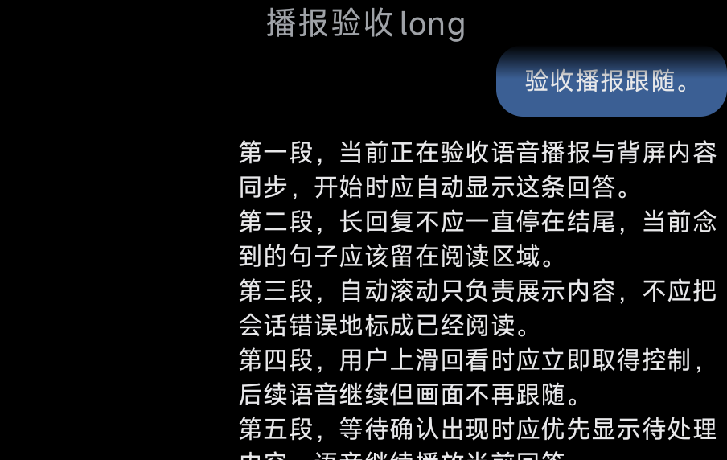
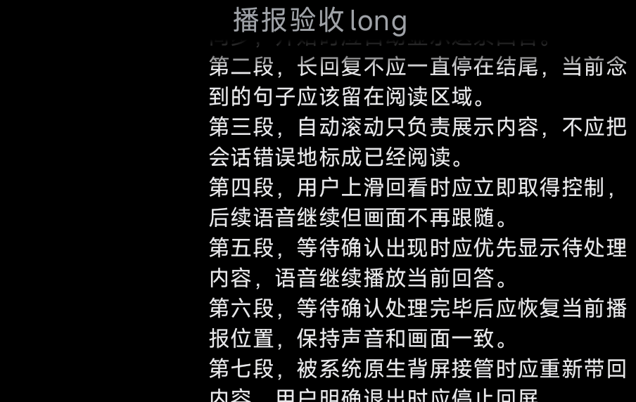

# Voice Broadcast Follow 真机验收

日期：2026-10-04，Asia/Shanghai。
设备：小米 17 Pro（25098PN5AC），HyperOS OS3.0。

实现提交：`6639bed`；等待确认修复：`7735040`。
联合版本保留列表渐变修复 `cd30a1b`（本分支提交 `952dcfe`）。
最后一次 APK 安装返回 `Success`，SHA-256：
`9CFB1EA38DF25340F8C71D8B8D06C847D7F22A35FECA7B63C20333CE3D62FE49`。

## 已完成的实机验证

| 场景 | 结果 | 证据 |
| --- | --- | --- |
| 播报开始自动显示来源会话 | 通过：从其他会话切到调试来源会话 | `long-start.png` |
| 长回复按句滚动 | 通过：10 句依次播报，滚动位置从 0 推进到 456，当前句保持可读 | `long-reclaim-events.txt`、`long-progress-4.png` |
| Native Rear Screen 接管后回屏 | 通过：启动 SubScreenLauncher 后 Dashboard 被销毁，随后自动重建并返回背屏；约 4.5 秒完成，6 秒截图已恢复 | `long-reclaim-events.txt`、`reclaim-after-native-6s.png` |
| 用户回看接管 | 通过：手动回看后停止视觉跟随，语音继续推进 | `manual-events.txt` |
| 回看位置保持 | 通过：间隔 8 秒的两张截图 SHA-256 完全相同 | `manual-after-swipe.png`、`manual-held.png` |

回看截图 SHA-256：
`81797A1665B04AC421A4DC7B4239F721AC4857B054FDC1BEB1B9D77A2D13A1C2`。

## 发现并修复

- 首次订阅滚动位置也会发出初值，原实现把它误判为用户滚动。只在位置确实变化时暂停，已在上述滚动/回看验收中验证。
- 等待确认期间，其他会话的普通状态更新会提前恢复视觉跟随。实机日志在 23:18:21.228 暂停、23:18:22.608 恢复，而等待会话到 23:18:28.704 才解除；见 `waiting-before-fix-events.txt`。
- `7735040` 改为检查 Dashboard 当前最高优先级会话，并扩展 debug 注入以支持独立调试会话。修复已构建、安装，设备复验尚未完成。

## 自动验证

- `gradlew test :app:assembleDebug --no-daemon`：通过。
- 当前测试报告合计 1,228 项（包含 Debug/Release 变体），失败、错误、跳过均为 0；补充已阅断言后 `:core:test` 再次通过。
- Core 的自动聚焦与播放结束场景验证 `UNREAD` 不会被自动展示改成 `READ`。
- 队列跳过场景验证后续条目仍保留自己的来源会话；等待确认优先、来源定位和手动退出均有纯规则判例。
- `git diff --check`：通过。

## 尚未完成

最后一次安装后无线调试断开；原地址无法连接，mDNS 未发现设备，原 IP 的连通性探测也超时。

1. 用两个独立会话复验等待确认优先，以及确认解除后恢复跟随。
2. 锁屏状态下的播报回屏。
3. 真实背屏手动退出后，在当前播报剩余句子中保持退出。

APK 安装成功不等于上述场景验收成功。当前结论只覆盖上表；保留草稿 PR，恢复设备连接后继续补齐。
